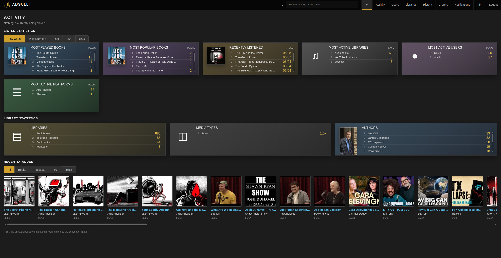
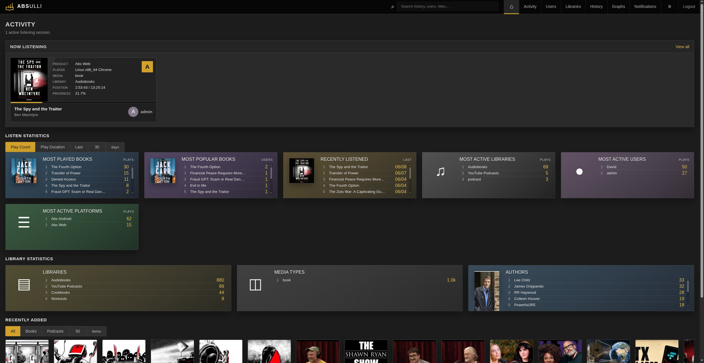
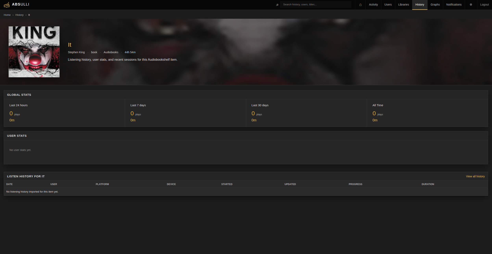
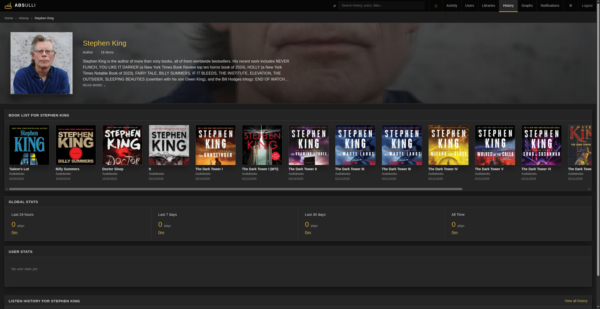
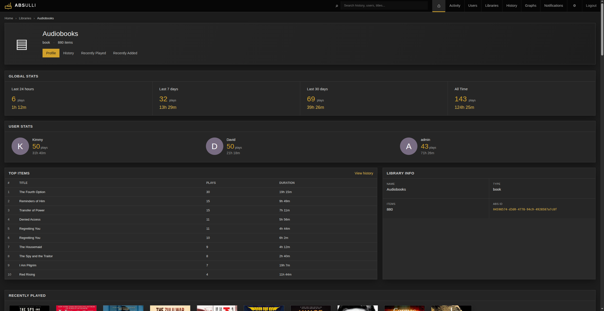
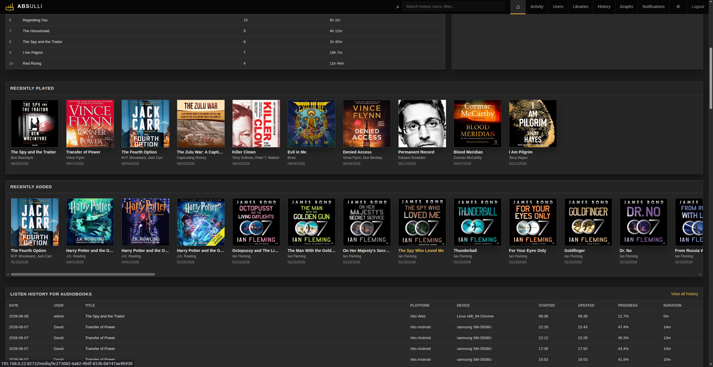
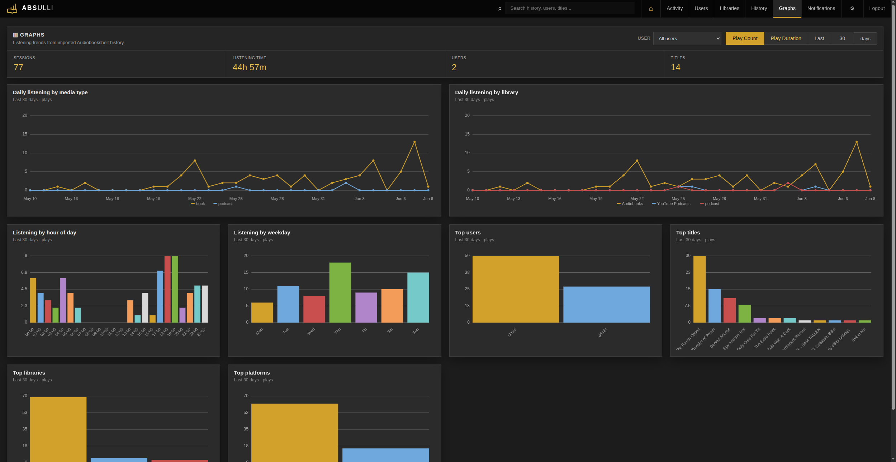

<p align="center">

<h3 align="center">A self-hosted companion dashboard for Audiobookshelf</h3>

<p align="center">
  <a href="https://github.com/operationETH/ABSulli/releases">
    
  </a>
  <a href="https://github.com/operationETH/ABSulli/blob/main/LICENSE">
    
  </a>
  <a href="https://hub.docker.com/r/operationeth/absulli">
    
  </a>
  <a href="https://github.com/operationETH/ABSulli/pkgs/container/absulli">
    
  </a>
  <a href="https://ca.unraid.net/apps/absulli-08kx2l31cthp3f">
    
  </a>
</p>

---

> [!NOTE]
> AI assistance was used during development of this project. The code has been reviewed and tested to the best of my ability, but ABSulli is still under active development. Users should review and validate it for their own environment before relying on it. If you find a bug, please open an [issue](https://github.com/operationETH/ABSulli/issues).

ABSulli is an [Audiobookshelf](https://github.com/advplyr/audiobookshelf) companion dashboard inspired by the concept of [Tautulli](https://github.com/Tautulli/Tautulli). Track audiobook and podcast listening activity, browse library stats, view history, manage notifications, and expose Prometheus metrics from one self-hosted web interface.

---

## Features

- First-run setup wizard - no config file needed to get started
- GUI settings management with optional environment variable overrides
- Current listening activity
- Library and user overview
- Recently added media
- Listening history
- Built-in graphs and Prometheus metrics endpoint
- Notification support (Gotify, ntfy, Discord, Slack, Telegram, Pushover, Pushbullet, Email, Webhook)
- Local SQLite storage - no external database
- Built-in login with rate limiting and audit logging

---

## Screenshots









---

## Quick start

### docker-compose.yml

```yaml
services:
  absulli:
    image: ghcr.io/operationeth/absulli:latest
    container_name: absulli
    restart: unless-stopped
    ports:
      - "8272:8272"
    environment:
      - TZ=America/Phoenix
      - PUID=1000
      - PGID=1000
    volumes:
      - ./data:/config
```

```bash
docker compose up -d
```

Then open **http://\<server-ip\>:8272** and follow the setup wizard.

The wizard will ask for your Audiobookshelf URL and API key, create an admin login, and immediately start importing your data. No `.env` file required.

After setup, all connection and notification settings can be managed from the **Settings** page.

---

## Getting your Audiobookshelf API key

1. Open Audiobookshelf and go to **Settings → API-keys → Add API Key**
2. Name ABSulli
3. Select your admin user
4. Copy the API token from the token field

---

## Optional: pre-fill with environment variables

If you prefer to manage the Audiobookshelf connection via env rather than the setup wizard, create a `.env` file next to your `docker-compose.yml`:

```env
ABS_URL=http://192.168.1.50:13378
ABS_API_KEY=your_abs_api_key_here
```

When these are set, the setup wizard shows them as read-only and uses them automatically.

---

## Prometheus metrics

ABSulli exposes Prometheus metrics at `/metrics`. This can be scraped by Prometheus for Grafana dashboards or external monitoring.

If you configure a metrics token, include it as a bearer token or with the `X-Absulli-Metrics-Token` header. The metrics token can be configured in Settings → Network.

---

## Data and privacy

ABSulli stores all data locally in `/config`:

| File | Contents |
|------|----------|
| `absulli.db` | SQLite database - activity, history, settings |
| `secret_key` | Session signing key - keep private |

By default, no data is sent anywhere outside your network. ABSulli communicates with your Audiobookshelf instance, and only sends outbound notification requests if you configure notification agents.

---

## Upgrading

Before upgrading, back up your config directory. The most important file is `/config/absulli.db`, which contains your ABSulli settings, activity, and listening history. If you use the example compose file, that is usually `./data/absulli.db` on the host.

To upgrade a Docker install:

```bash
docker compose pull
docker compose up -d
```

ABSulli runs database migrations automatically during startup. Watch the logs after upgrading to confirm the app starts cleanly:

```bash
docker logs absulli -f
```

For local development builds, rebuild and restart instead:

```bash
docker compose build --no-cache
docker compose up -d
```

---

## Database migrations

ABSulli uses Alembic for database schema migrations. Migrations run automatically on startup.

Existing installs created before Alembic are safely baselined on first start: ABSulli keeps the old additive column check for that one upgrade path, stamps the database at the current migration, and future schema changes are handled through Alembic revisions.

---

## Reverse proxy

ABSulli runs on port `8272` by default. To put it behind Nginx or Traefik, proxy to `http://absulli:8272` and set `ABSULLI_COOKIE_SECURE=true` in your `.env` or enable "HTTPS Secure Cookies" in Settings → Network if serving over HTTPS.

ABSulli sets its own security headers (`Content-Security-Policy`, `X-Frame-Options`, `Referrer-Policy`, etc.) on every response. You do not need to add these in your proxy config.

---

## Security

ABSulli ships with the following enabled by default:

- PBKDF2-SHA256 (600,000 iterations) for password storage
- Signed session cookies with server-side revocation
- Per-request CSP nonces - no `unsafe-inline`
- Login rate limiting with lockout, persisted across restarts
- Login audit log (IP, user agent, outcome, reason)
- CSRF protection on all form submissions
- Separate API and metrics tokens with independent scopes

Authentication is required after setup and recommended for all installs.

---

